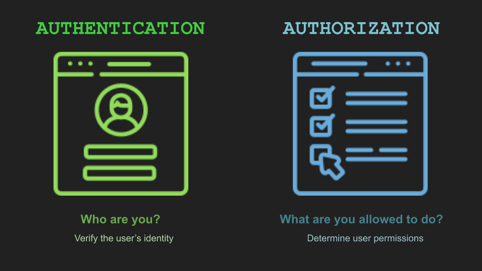

# ASP.NET-Core-Identity

<ul>
   <li><a href="https://www.youtube.com/watch?v=sPbDrqpme_w&list=PL6n9fhu94yhVkdrusLaQsfERmL_Jh4XmU&index=66">Register new user using asp net core identity</a></li>
   <li><a href="https://www.youtube.com/watch?v=TfarnVqnhX0&list=PL6n9fhu94yhVkdrusLaQsfERmL_Jh4XmU&index=67">ASP NET Core Identity UserManager and SignInManager</a></li>
   <li><a href="https://www.youtube.com/watch?v=kC9qrUcy2Js&list=PL6n9fhu94yhVkdrusLaQsfERmL_Jh4XmU&index=68">ASP NET core identity password complexity</a></li>
    <li><a href="https://www.youtube.com/watch?v=YLAHIZmO2PI&list=PL6n9fhu94yhVkdrusLaQsfERmL_Jh4XmU&index=69">Show or hide login and logout links based on login status in asp net core</a></li>
    <li><a href="https://www.youtube.com/watch?v=9d8DXXc71RI&list=PL6n9fhu94yhVkdrusLaQsfERmL_Jh4XmU&index=70">SImplementing login functionality in asp net core</a></li>
     <li><a href="https://www.youtube.com/watch?v=uET7MjhUeY4&list=PL6n9fhu94yhVkdrusLaQsfERmL_Jh4XmU&index=71">Authorization in ASP NET Core</a></li>
     <li><a href="https://www.youtube.com/watch?v=-asykt9Zo_w&list=PL6n9fhu94yhVkdrusLaQsfERmL_Jh4XmU&index=72&t=4s">Redirect user to original url after login in asp net core</a></li>
     <li><a href="https://www.youtube.com/watch?v=0q0CZTliQ7A&list=PL6n9fhu94yhVkdrusLaQsfERmL_Jh4XmU&index=73">Open redirect vulnerability example</a></li>
      <li><a href="https://www.youtube.com/watch?v=NV734cJdZts&list=PL6n9fhu94yhVkdrusLaQsfERmL_Jh4XmU&index=77">Extend IdentityUser in ASP NET Core
</a></li>
     <li><a href="https://www.youtube.com/watch?v=TuJd2Ez9i3I&list=PL6n9fhu94yhVkdrusLaQsfERmL_Jh4XmU&index=78&t=70s">Creating roles in asp net core
</a></li>
 <li><a href="https://www.youtube.com/watch?v=KGIT8P29jf4&list=PL6n9fhu94yhVkdrusLaQsfERmL_Jh4XmU&index=79">Get list of roles in asp net core
</a></li>
 <li><a href="https://www.youtube.com/watch?v=7ikyZk5fGzk&list=PL6n9fhu94yhVkdrusLaQsfERmL_Jh4XmU&index=80">Edit role in asp net core
</a></li>
 <li><a href="https://www.youtube.com/watch?v=TzhqymQm5kw&list=PL6n9fhu94yhVkdrusLaQsfERmL_Jh4XmU&index=81">Add or remove users from role in asp net core
</a></li>
 <li><a href="https://www.youtube.com/watch?v=DXVe6skc42k&list=PL6n9fhu94yhVkdrusLaQsfERmL_Jh4XmU&index=82">ASP NET Core role based authorization
</a></li>
<li><a href="https://www.youtube.com/watch?v=IPjK65ehQBg&list=PL6n9fhu94yhVkdrusLaQsfERmL_Jh4XmU&index=83">Show or hide navigation menu based on user role in asp net core
</a></li>
<li><a href="https://www.youtube.com/watch?v=OMX0UiLpMSA&list=PL6n9fhu94yhVkdrusLaQsfERmL_Jh4XmU&index=84">List all users from asp net core identity database
</a></li>
<li><a href="https://www.youtube.com/watch?v=QYlIfH8qyrU&list=PL6n9fhu94yhVkdrusLaQsfERmL_Jh4XmU&index=85">Edit identity user in asp net core
</a></li>
<li><a href="https://www.youtube.com/watch?v=MhNfyZGfY-A&list=PL6n9fhu94yhVkdrusLaQsfERmL_Jh4XmU&index=86">Delete identity user in asp net core
</a></li>
<li><a href="https://www.youtube.com/watch?v=hKLjt9GzYM8&list=PL6n9fhu94yhVkdrusLaQsfERmL_Jh4XmU&index=87">ASP NET Core delete confirmation
</a></li>
<li><a href="https://www.youtube.com/watch?v=pj3GCelrIGM&list=PL6n9fhu94yhVkdrusLaQsfERmL_Jh4XmU&index=88">Delete identity role in asp net core
</a></li>
<li><a href="https://www.youtube.com/watch?v=txTZAFut9mA&list=PL6n9fhu94yhVkdrusLaQsfERmL_Jh4XmU&index=89">Enforce ON DELETE NO ACTION in entity framework core
</a></li>
<li><a href="https://www.youtube.com/watch?v=1OaVUy1pRXA&list=PL6n9fhu94yhVkdrusLaQsfERmL_Jh4XmU&index=91">Manage user roles in asp net core identity
</a></li>
<li><a href="https://www.youtube.com/watch?v=Qobkh8gEP6Q&list=PL6n9fhu94yhVkdrusLaQsfERmL_Jh4XmU&index=92">Model binding not working on submitting razor view with foreach loop
</a></li>
<li><a href="https://www.youtube.com/watch?v=5XA4Z-SOif8&list=PL6n9fhu94yhVkdrusLaQsfERmL_Jh4XmU&index=93">Manage user claims in asp net core
</a></li>
<li><a href="https://www.youtube.com/watch?v=LJQBBvJ6tL0&list=PL6n9fhu94yhVkdrusLaQsfERmL_Jh4XmU&index=94">Claims based authorization in asp net core
</a></li>
<li><a href="https://www.youtube.com/watch?v=Uw2ujXvN3i4&list=PL6n9fhu94yhVkdrusLaQsfERmL_Jh4XmU&index=95">Role based authorization vs claims based authorization in asp net core
</a></li>
<li><a href="https://www.youtube.com/watch?v=ZgPK51X5BGw&list=PL6n9fhu94yhVkdrusLaQsfERmL_Jh4XmU&index=104">External identity providers in asp net core
</a></li>
<li><a href="https://www.youtube.com/watch?v=V4KqpIX6pdI&list=PL6n9fhu94yhVkdrusLaQsfERmL_Jh4XmU&index=105">Create google oauth credentials Client Id and Client Secret
</a></li>
   <li><a href="[https://www.youtube.com/watch?v=V4KqpIX6pdI&list=PL6n9fhu94yhVkdrusLaQsfERmL_Jh4XmU&index=105](https://www.youtube.com/watch?v=fgzRnlB992s&list=PL6n9fhu94yhVkdrusLaQsfERmL_Jh4XmU&index=106)">ASP NET Core google authentication setting up the UI
</a></li>
</ul>
